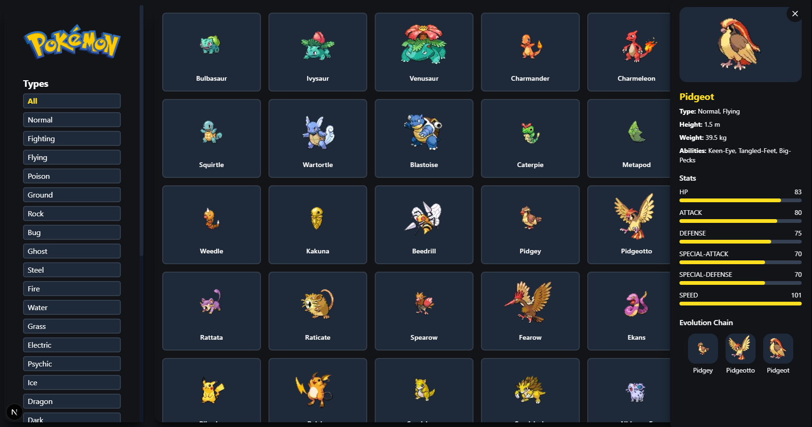

# Pokemon Dashboard

Projeto desenvolvido com **Next.js**, **React 19** e **Tailwind CSS** que exibe um grid de Pokémons com informações detalhadas e evoluções de cada um.
Os dados são consumidos da [PokéAPI](https://pokeapi.co/).



---

## 🔍 Funcionalidades

- ✅ Listagem de Pokémons
- ✅ Visualização de detalhes do Pokemon
  - Sprites
  - Tipos
  - Altura
  - Peso
  - Habilidade
  - Status
- ✅ Exibição da **cadeia evolutiva** com imagens
- ✅ Design responsivo com Tailwind CSS
- ✅ UI limpa e moderna com ícones vetoriais via Lucide Icons

---

🛠 Tecnologias

- Next.js: Framework React para produção
- React 19: Biblioteca de UI moderna
- Tailwind CSS: Utilitários CSS para layout responsivo
- PokéAPI: API REST pública de dados Pokemon
- Lucide Icons: Ícones SVG acessíveis e modernos

---

## 🚀 Como rodar localmente

1. Clone o repositório:

```bash
   git clone https://github.com/seu-usuario/dashboard-pokemon.git
   cd dashboard-pokemon
```

2. Instale as dependências:

```bash
    npm install
```

3. Inicie o servidor de desenvolvimento:

```bash
    npm run dev
```

4. Acesse no navegador

```bash
http://localhost:3000
```

---

✨ Autor
Feito com 💖 por Poliana Bozzano

---

📬 Contato
Se quiser trocar uma ideia, me chama por aqui:

- ✉️ Email: polibozzano@gmail.com
- 💼 LinkedIn: linkedin.com/in/polianabozzano
